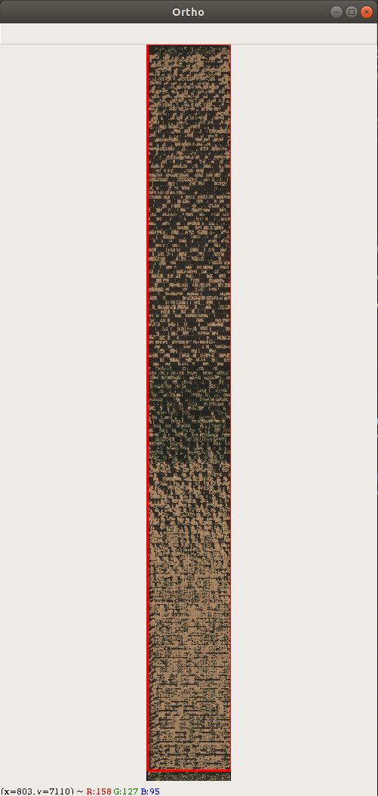
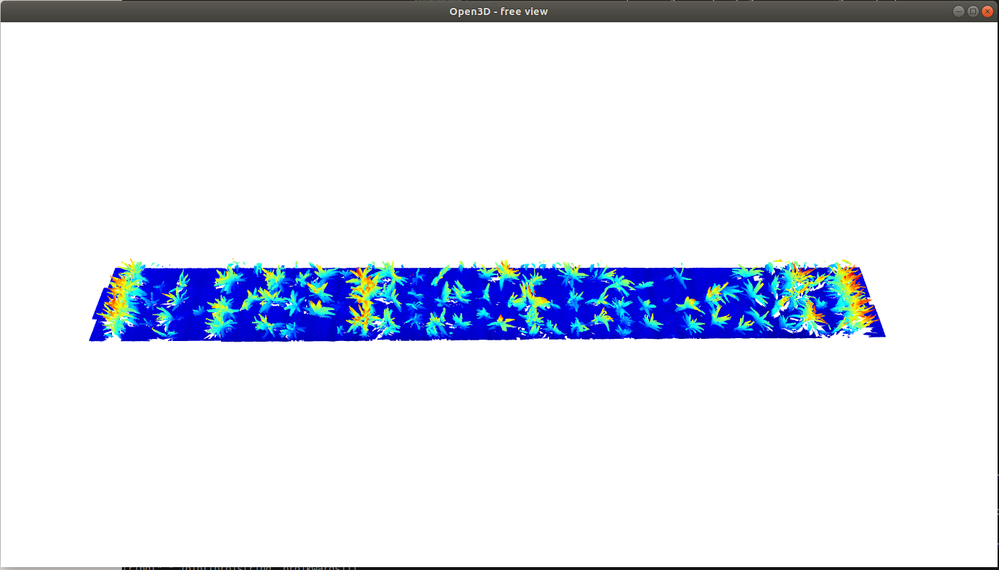

# 3D Landmakr Selection GUI

This repo is used to geo-correct the aligned 3D point clouds generated by the laser scanner mounted on the Gantry which is located at Maricopa Agricultural Center for University of Arizona. This code works in parallel with another repo (Phytooracle Data Repo). This repo is tested on the data generated for seasons 10, 11, and 12 so far and it works without any issue on those seasons. You can run the code using either Docker or this repo.

## Running landmark selection using container - recommended

For help running the container, [click here](https://github.com/phytooracle/3d_landmark_selection/blob/main/running_landmark_selection.md).

<!-- ### Linux/Ubuntu

- Open terminal
- Execute `xhost +local:root`
- Execute with `docker run -it --rm --env="DISPLAY" --env="QT_X11_NO_MITSHM=1" --volume="/tmp/.X11-unix:/tmp/.X11-unix:rw" phytooracle/3d_landmark_selection -s <scan date> -S <season number> -a`
- Execute `xhost -local:root` once finished

### MacOS

- Make sure to have XQuarz installed
- Navigate to the XQuarz settings and activate the option "Allow connections from network clients"
- Open terminal
- Execute `xhost +local:root` OR `xhost + 127.0.0.1`
- Execute with `docker run -e DISPLAY=host.docker.internal:0 phytooracle/3d_landmark_selection -s <scan date> -S <season number> -a`
- Execute `xhost -local:root` OR `xhost - 127.0.0.1` once finished

### Windows 10 with WSL2

- Make sure to be able to execute X11 (refer to [this article](https://virtualizationreview.com/articles/2017/02/08/graphical-programs-on-windows-subsystem-on-linux.aspx) for links on installing X11 on Windows 10)
- Access Linux subsystem
- Execute `xhost +local:root`
- Execute with `docker run -it --rm --env="DISPLAY" --env="QT_X11_NO_MITSHM=1" --volume="/tmp/.X11-unix:/tmp/.X11-unix:rw" phytooracle/3d_landmark_selection -s <scan date> -S <season number> -a`
- Execute `xhost -local:root` once finished -->
<!-- 
## Local installation instructions - not recommended

Please follow these steps to clone the necessary repo and configure the environment properly.

```
git clone https://github.com/phytooracle/3d_landmark_selection
git clone https://github.com/phytooracle/phytooracle_data
cd 3d_landmark_selection
cp sample.env .env
```

Edit .env so that it points to where you put the phytooracle*data repo, \_and* where you want to (or already do) store data.

### Conda install

```
conda create -n landmark_gui
conda activate landmark_gui
conda install python=3.7.11
conda install -c conda-forge opencv
```

Go to http://www.open3d.org/docs/latest/getting_started.html and find the correct link under "Development version (pip)" and use it in the following command...,

```
conda install pip
pip install --pre https://storage.googleapis.com/open3d-releases-master/python-wheels/open3d-0.13.0+299f29e-cp37-cp37m-manylinux_2_27_x86_64.whl
```

```
conda install tifffile
conda install gdal
conda install pyproj
pip install python-dotenv
pip install imagecodecs
``` -->

## Using the GUI

Run the following command from the `3d_landmark_selection` folder in your terminal after activating the conda environment.

```
python main.py -s [date] -S [season_number] [-a]
```

`[date]` specifies the scan date you wish to geo-correct, `[season_number]` specifies the number of the season and `-a` is an optional argument specifying whether to use aligned or pre-processed outputs of the previous step.

After running this command, if your environment is correctly configured, the required data will be automatically downloaded from cyverse by use of iCommands. If the data is already downloaded, this step would be skipped. Once everything is downloaded successfully, the following window containing an RGB ortho will be visualized.



You can pan around this ortho and select landmarks by double clicking on a pixel. Note that once you do that, it would lock the current window and find nearby 3d point cloud files. Once those point clouds are merged together, another window will be visualized containing those point clouds. To mark a landmark on the RGB ortho with a blue circle, press your scroll button on your mouse.



In this window you can pan around the point cloud in 3d and select the corresponding point to the selected landmark. Use the following instructions and shortcut keys to work with this visualizer:

| Action                                                                             |                                                                 Instruction                                                                 |
| :--------------------------------------------------------------------------------- | :-----------------------------------------------------------------------------------------------------------------------------------------: |
| move the point cloud or traverse on it                                             | hold down your `mouse scroll button` while moving it / hold down your `control key` and drag the point cloud using your `left mouse button` |
| zoom in and out                                                                    |                                                            `mouse scroll button`                                                            |
| rotate the point cloud                                                             |                                                     drag using your `left mouse button`                                                     |
| increase and decrease the size of the points                                       |                                                              `+` and `-` keys                                                               |
| select a point                                                                     |                                           hold down the `shit key` and `left click` on the point                                            |
| remove the last selected point                                                     |                                       hold down the `shift key` and `right click` on the point cloud                                        |
| increase and decrease the size of the landmark marker                              |                                            hold down the `shift key` and press `+` and `-` keys                                             |
| exit the 3d visualizer (either after selecting the landmark or in order to cancel) |                                                                  press `q`                                                                  |

Once you selected enough landmarks in RGB and their corresponding point in the point cloud, press `q` in the ortho window.

We recommend selecting at leaset 5-10 landmark points, preferably scattered throughout the entire field. If enough landmarks were selected, a transformation is going to be calculated and if the transformation error is below a threshold, a json file containing the transformation will be created and uploaded to cyverse after the transformation is printed out in the terminal.
